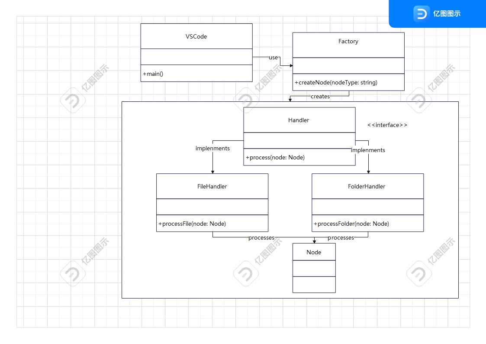

# ChiikaCode 二次开发详细设计报告

ChiikaCode是一个利用RAG（Retrieval-Augmented Generation）进行工程级代码生成的VS Code插件，旨在通过集成后端API来实现项目的自动化生成、文件上传与处理、以及自动化提问等功能。以下是项目的设计和实现概述：

## 一、前端工程级别代码生成功能部分

### 1.1. 插件设计与架构

VS Code 插件的核心目标是为用户提供一个直观的界面，支持生成项目代码、上传文件与文件夹、以及通过提问与后端交互。设计上采用了VS Code的Webview API，后端通过HTTP请求响应插件前端。

#### 主要组件

- **Webview**：前端UI由Webview承载。UI包括语言选择、项目需求输入框、函数名与参数输入框、以及多个交互按钮（生成项目、生成代码、提问、上传文件等）。
- **后端交互**：插件与本地后端服务通过HTTP请求进行数据交互，执行代码生成、项目生成等操作。后端服务通常提供RESTful接口，如生成项目、生成代码、回答问题、文件上传等。
- **文件系统操作**：通过VS Code API操作工作区文件系统，创建目录、写入文件，甚至上传文件和文件夹。

#### 工作流程

1. 用户在插件UI中选择编程语言、输入项目需求或代码生成相关信息。
2. 前端通过`postMessage`向后端发送请求，后端根据请求生成项目或代码并返回结果。
3. 如果涉及文件上传，前端会获取文件路径或文件夹路径，通过HTTP上传到后端进行处理。
4. 后端处理完成后，前端显示相应的结果或代码，用户可以在VS Code中查看、编辑和保存。

### 1.2. 插件设计与架构

#### 1.2.1. 观察者模式

在此项目中，`onDidReceiveMessage` 和 `window.addEventListener('message')` 便是典型的观察者模式应用。前端UI通过事件监听机制接收后端返回的消息，并在接收到消息后更新UI。具体表现为：

- `webviewView.webview.onDidReceiveMessage` 用于监听用户与Webview交互的消息。
- `window.addEventListener('message')` 监听后端消息并更新UI，例如生成的代码、上传结果等。

这种模式使得前端与后端解耦，消息的发送者（后端或前端）与接收者（前端UI）不需要直接引用彼此。

#### 1.2.2. 工厂模式

在文件创建和保存的部分，使用了工厂模式来生成文件。具体的实现体现在`saveGeneratedFiles`和`processNode`方法：

- `processNode`方法根据传入的`nodeType`来决定是创建文件还是文件夹。文件夹会调用`createDirectory`方法，文件则通过`WorkspaceEdit`来创建文件并写入内容。这是工厂模式的一种实现，动态生成不同类型的文件或文件夹。

#### 1.2.3. 策略模式

在处理不同类型的请求时，策略模式应用在`handleMessage`方法中。不同的命令（如`generateProject`、`askQuestion`、`uploadFile`等）有不同的处理策略。根据消息中的`command`字段，选择相应的处理方法来执行：

- 生成项目：调用`generateProject`接口。
- 提问：调用`askQuestion`接口。
- 上传文件：调用`uploadFile`接口。
- 生成代码：调用`generateCode`接口。
  
这种方式可以将不同的处理逻辑封装到独立的策略中，便于扩展和维护。

#### 1.2.4. 单例模式

在插件中，`NewViewProvider` 类采用了单例模式的设计。`viewType` 是该类的静态常量，它在VS Code中只会被实例化一次。这个模式确保了只有一个实例处理所有的Webview交互。

### 1.3. 实例分析

#### 1.3.1. 观察者模式实例

```js
webviewView.webview.onDidReceiveMessage(async message => {
    await this.handleMessage(message, webviewView);
});
```


在这里，`onDidReceiveMessage`监听从前端发来的消息，当接收到消息后执行`handleMessage`方法，更新UI或者执行相应的后台逻辑。每次用户在Webview中交互时，都会触发这个监听器。

#### 1.3.2. 工厂模式实例

```js
if (nodeType === 'folder') {
    const absoluteFolderPath = vscode.Uri.file(`${workspacePath}/${currentPath}`);
    await vscode.workspace.fs.createDirectory(absoluteFolderPath);
    if (node.children && Array.isArray(node.children)) {
        for (const childNode of node.children) {
            await this.processNode(childNode, workspacePath, currentPath);
        }
    }
} else if (nodeType === 'code' || nodeType === 'file') {
    const content = node.content || '';
    const absoluteFilePath = vscode.Uri.file(`${workspacePath}/${currentPath}`);
    const fileFolder = absoluteFilePath.with({ path: absoluteFilePath.path.split('/').slice(0, -1).join('/') });

    await vscode.workspace.fs.createDirectory(vscode.Uri.file(fileFolder.path));
    const edit = new vscode.WorkspaceEdit();
    edit.createFile(absoluteFilePath, { overwrite: true });
    edit.set(absoluteFilePath, [
        new vscode.TextEdit(new vscode.Range(0, 0, 0, 0), content)
    ]);
    await vscode.workspace.applyEdit(edit);
}
```

这段代码是文件生成和目录创建的核心逻辑。根据nodeType判断是文件还是文件夹，并通过不同的方式来处理它们。这是典型的工厂模式，每种类型的数据（文件或文件夹）都有不同的处理策略。



#### 1.3.3. 策略模式实例

```js
switch (message.command) {
    case 'generateProject':
        // 生成项目的策略
        break;
    case 'askQuestion':
        // 提问的策略
        break;
    case 'uploadFile':
        // 上传文件的策略
        break;
    default:
        // 其他默认策略
        break;
}
```

根据不同的`command`值，选择不同的策略来处理。每种策略都封装了特定的业务逻辑，使得系统可以灵活地扩展。


#### 1.3.4. 单例模式

在插件中，`NewViewProvider` 类采用了单例模式的设计。`viewType` 是该类的静态常量，它在VS Code中只会被实例化一次。这个模式确保了只有一个实例处理所有的Webview交互。

### 1.4. 前端分析结语

ChiikaCode插件的设计考虑了用户体验与后端处理的分离，采用了多种设计模式来确保系统的高扩展性和低耦合度。通过合理地应用观察者模式、工厂模式、策略模式和单例模式，该插件能够有效地处理不同类型的用户交互，并与后端系统实现无缝的集成。
